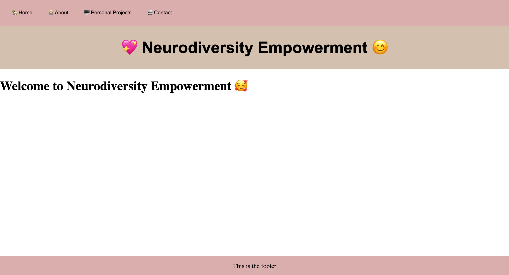

# Neurodiversity Empowerment

This is a personal project that I am currently working on. My overarching goal is to raise awareness of Neurodiversities in general, in New Zealand.

* MVP (Minimum Viable Project)

Neurodiversity Empowerment will display a list of Neurodiversities that are common to people all around the world. The user will be able to see an image of the Neurodiversity, its name and a short blurb as to what it is. These names will also be displayed as icons. In addition I will have a link to more information about me and my Neurodiversities (Dyspraxia, Dyscalculia) in the navigation bar. 

In the navigation bar the user will be able to see other Neurodiversity projects that I have been working on as well as additional information as to why I have shared other Neurodiversities. 

As MVP I will start with a list of four Neurodiversities with the intention to share more details and interesting information about them. 

* Stretch

1.	Be able to include a list of all the known Neurodiversities from around the world. 
2.	Add more information to the footer. 
3.	Add a Sign-in button on the right hand side of the navigation bar. 
4.	Have social media links in the navigation bar. 

## Technologies

React, API’s, HTML, CSS, JavaScript and Node. 

## Under Construction 

